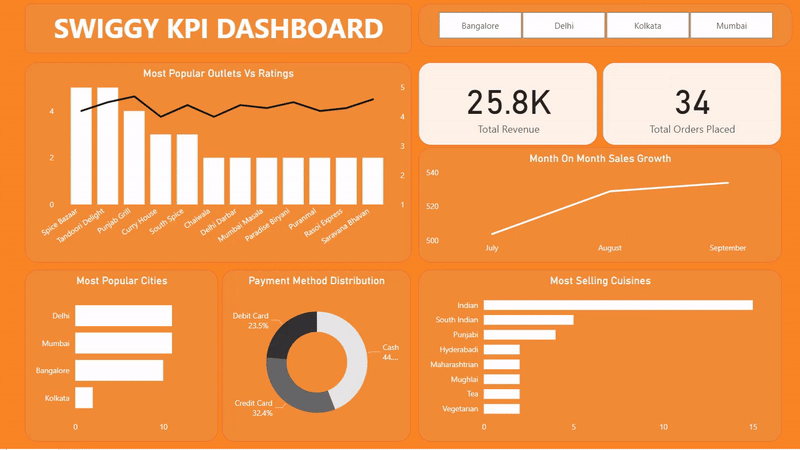
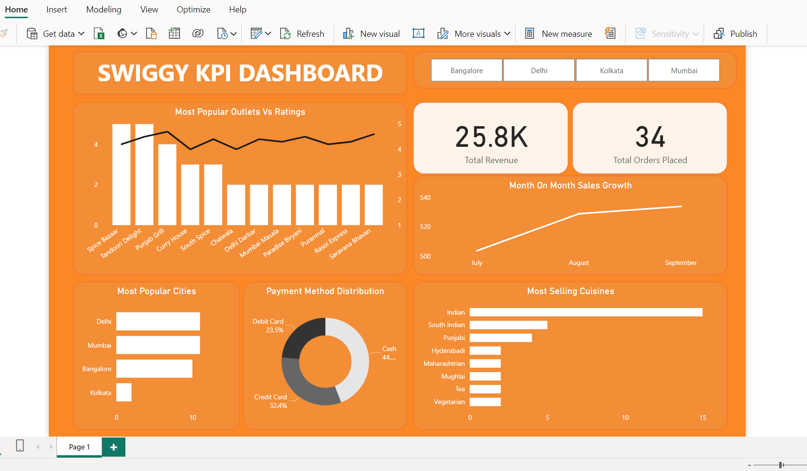

# Swiggy-Database-Design-Plus-Interactive-Dashboard
Designed a comprehensive database schema for Swiggy, a leading food delivery platform, and implemented it using MySQL. 

Populated the database with dummy data to simulate real-world scenarios. Leveraged SQL queries to derive valuable insights from the data and created an interactive dashboard using Power BI to visualize important metrics and KPIs.

Please find the dashboard showcased below.

